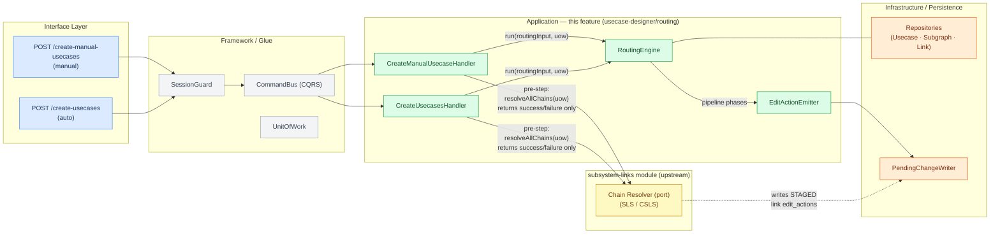
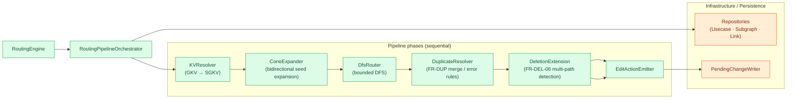

# Diagram 01: Feature Context & Module Boundaries

Renders in VS Code with the "Markdown Preview Mermaid Support" extension, or on GitHub.

## High-level flow

## Inside RoutingEngine

## Legend
- Solid arrow: synchronous call / dependency direction
- Dashed arrow: side-effect write (no data returned to caller)
- `---` line: structural read dependency (no data returned on diagram)
- Color bands: Interface (blue) · Framework/Glue (gray) · Upstream subsystem-links (yellow) · This feature (green) · Infrastructure (orange)

## Notes
Both HTTP entry points funnel through `SessionGuard` and `CommandBus` into their respective handlers. Each handler calls `IChainResolver.resolveAllChains(uow)` (owned by the `subsystem-links` module) as a mandatory pre-step. The chain resolver writes STAGED `data_link`/`control_link` `edit_actions` directly into the session and returns only success/failure — it does not return resolved link data to the handler. For raw-mode projects (the common case) the chain resolver is a fast no-op; the routing engine has no concept of chain resolution.

After the pre-step, each handler calls `RoutingEngine.run(routingInput, uow)` — this is the ONLY public API of the `routing` subfolder. `RoutingEngine` is the single facade; it internally delegates to `RoutingPipelineOrchestrator`, which drives the six-phase pipeline shown in Diagram 1b. The orchestrator reads from the repositories via the normal edit-crud overlay (which already includes any staged link edits written by the chain resolver) and delegates final write responsibility to `EditActionEmitter → PendingChangeWriter`. `UnitOfWork` wraps the repositories and `PendingChangeWriter` in a single edit-crud session (not shown as arrows to keep the flow diagram uncluttered). The `subsystem-links` subgraph is drawn in a distinct color to emphasise that `IChainResolver` is a consumed port, not part of this feature's internals.
