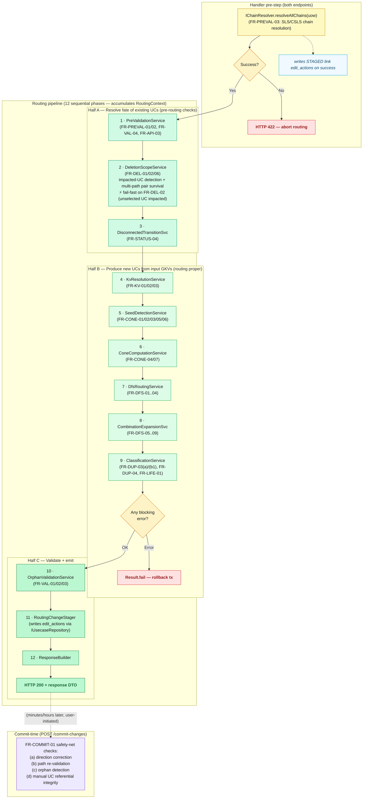

# Diagram 02: Phased Pipeline Overview

Renders in VS Code with the "Markdown Preview Mermaid Support" extension, or on GitHub.

## 2a. Full lifecycle

Shows the handler pre-step (chain resolution), the 12-phase sequential routing pipeline that accumulates state into `RoutingContext`, and the FR-COMMIT-01 safety-net that fires later at `POST /commit-changes`.

> **Note:** The RoutingEngine reads `data_link`/`control_link` normally via repositories. The pipeline has NO `resolvedChains` field — chain resolution writes STAGED link edit_actions directly; that result is never threaded through RoutingContext.

## 2b. Phase applicability by mode

Compares which of the 12 pipeline phases execute in Auto mode (`create-usecases`) versus Manual mode (`create-manual-usecases`), highlighting phases that are skipped or run with different logic in Manual mode.

```mermaid
flowchart LR
    classDef runs fill:#dcfce7,stroke:#16a34a,color:#1a1a1a
    classDef skipped fill:#e5e7eb,stroke:#9ca3af,color:#6b7280,font-style:italic
    classDef different fill:#fef9c3,stroke:#ca8a04,color:#1a1a1a

    subgraph AUTO["Auto mode (create-usecases)"]
        direction TB
        A1["1 · PreValidationService"]:::runs
        A2["2 · DeletionScopeService\n(impacted-UC detection + fail-fast FR-DEL-02)"]:::runs
        A3["3 · DisconnectedTransitionSvc"]:::runs
        A4["4 · KvResolutionService\n(resolves GKVs from payload)"]:::runs
        A5["5 · SeedDetectionService\n(discovers seed SGs)"]:::runs
        A6["6 · ConeComputationService"]:::runs
        A7["7 · DfsRoutingService\n(DFS pair discovery)"]:::runs
        A8["8 · CombinationExpansionSvc"]:::runs
        A9["9 · ClassificationService\n(full: dup merge + idempotency)"]:::runs
        A10["10 · OrphanValidationService"]:::runs
        A11["11 · RoutingChangeStager"]:::runs
        A12["12 · ResponseBuilder"]:::runs
        A1 --> A2 --> A3 --> A4 --> A5 --> A6 --> A7 --> A8 --> A9 --> A10 --> A11 --> A12
    end

    subgraph MANUAL["Manual mode (create-manual-usecases)"]
        direction TB
        M1["1 · PreValidationService"]:::runs
        M2["2 · DeletionScopeService\n(skipped — creates one new UC, no deletion scan)"]:::skipped
        M3["3 · DisconnectedTransitionSvc\n(skipped — no disconnected transition scan)"]:::skipped
        M4["4 · KvResolutionService\n(resolves provided GKVs)"]:::different
        M5["5 · SeedDetectionService\n(skipped — SGs provided)"]:::skipped
        M6["6 · ConeComputationService\n(skipped)"]:::skipped
        M7["7 · DfsRoutingService\n(skipped — pairs via DB query per FR-UC-01)"]:::skipped
        M8["8 · CombinationExpansionSvc\n(expands ordered activeSubgraphs path)"]:::different
        M9["9 · ClassificationService\n(partial — idempotency check only)"]:::different
        M10["10 · OrphanValidationService"]:::runs
        M11["11 · RoutingChangeStager"]:::runs
        M12["12 · ResponseBuilder"]:::runs
        M1 --> M2 --> M3 --> M4 --> M5 --> M6 --> M7 --> M8 --> M9 --> M10 --> M11 --> M12
    end
```

## Legend

- Yellow band / node: upstream module (subsystem-links) involvement, or phase runs with mode-specific logic
- Green band / node: routing pipeline phase runs normally (darker green = Half A pre-routing; standard green = Half B routing; lighter green = Half C validate + emit)
- Gray node: phase skipped in this mode
- Purple band: commit-time safety net (runs separately at `POST /commit-changes`, not inside the routing pipeline)
- Red terminal: blocking error path (transaction rolled back)
- Green terminal: success path (HTTP 200 returned)

## Notes

The routing pipeline is strictly sequential and is organized into three explicit halves. Half A ("Resolve fate of existing UCs") runs first as intentional pre-routing checks: PreValidationService guards inputs, DeletionScopeService detects impacted UCs and fail-fasts on FR-DEL-02 (an unselected UC would be impacted), and DisconnectedTransitionSvc handles status transitions — all before any new UC production begins. Half B ("Produce new UCs from input GKVs") performs routing proper: KV resolution, seed and cone computation, DFS traversal, combination expansion, and classification. A blocking error at the end of Half B causes an immediate `Result.fail` return and a full transaction rollback; Half C does not execute. Half C ("Validate + emit") runs only on the clean path: orphan validation, staging edit_actions via `IUsecaseRepository`, and response construction. Each of the 12 phases reads from and writes to a shared `RoutingContext` object, but individual service implementations are stateless — all mutable state lives in `RoutingContext` and the surrounding unit-of-work. The FR-COMMIT-01 safety-net (direction correction, path re-validation, orphan detection) is intentionally separate from the routing pipeline — it runs minutes or hours later when the user explicitly triggers `POST /commit-changes`, providing a final guard before pending changes are persisted. In Manual mode, phases 2, 3, 5, 6, 7, and 8 are bypassed because the caller supplies SG identifiers directly and pair discovery is performed via a targeted DB query (FR-UC-01) rather than graph traversal; phase 9 runs in partial mode (idempotency check only). For projects without subsystems (the common case), the chain resolver is a fast no-op — the routing engine has no coupling to that feature.
